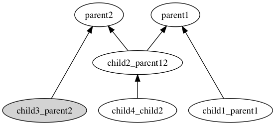
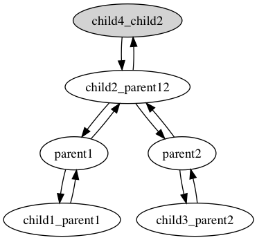
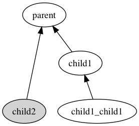
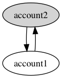
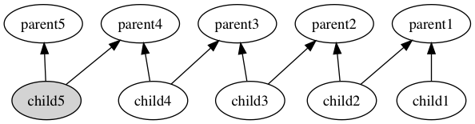

# UbiGraphviz
graphvizの静止画像を生成するにはdotを使います。

## Installation

Add this line to your application's Gemfile:

```ruby
gem 'ubi_graphviz'
```

And then execute:

    $ bundle

Or install it yourself as:

    $ gem install ubi_graphviz

## Usage
```ruby
account = FactoryBot.create(:blank_account, login: :parent)
ubi_graphviz = UbiGraphviz::AccountModel.new(account, method_name: :login, filename: 'test')
ubi_graphviz.write # test.dot というファイルに出力する
ubi_graphviz.run_dot_command # dotコマンドが使ってtest.pngというファイル名で画像を出力する
```

### 出力例
テストコードで記述している図






## License

The gem is available as open source under the terms of the [MIT License](https://opensource.org/licenses/MIT).
